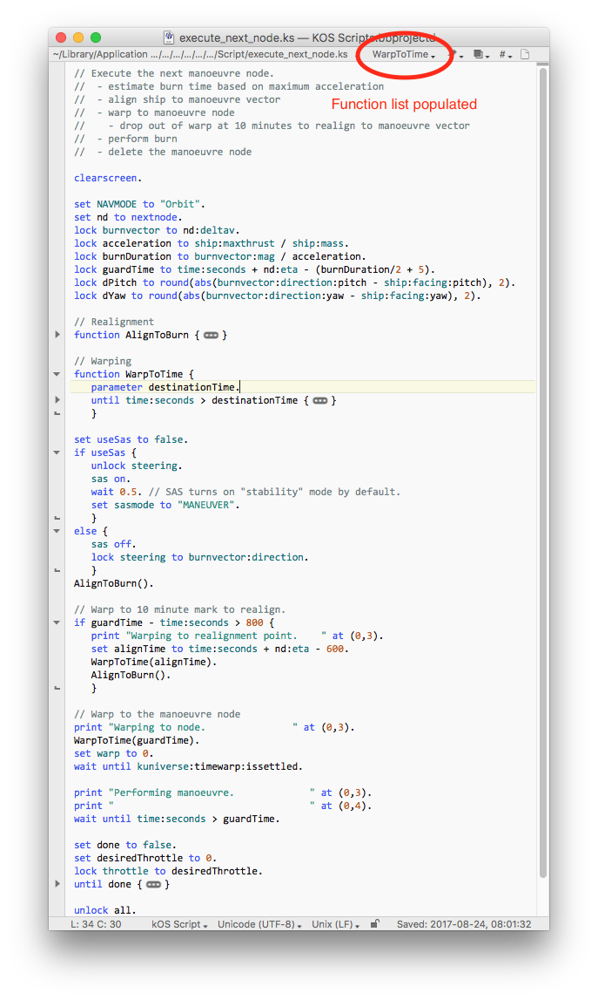

# BBEdit Syntax Highlighting

This Codeless Language Module for BBEdit provide basic syntax highlighting for KOS. At this stage it covers:

 - commands & built in functions show as predefined symbols
 - bound variables show as language keywords
 - strings are highlighted
 - comments are highlighted
 - blocks can be folded (blocks are delimited with braces)
 - function names are added to the function drop down

Suffixes are not covered (so ship:altitude will be coloured because altitude is a bound variable, but ship:orbit:longitudeofascendingnode will not be coloured).

## Installation

For a normal BBEdit install:

 - copy KOS.plist to: `~/Library/Application Support/BBEdit/Language Modules`
 - restart BBEdit

If you use a modified installation for syncing preferences between machines (e.g. via Dropbox), you'll need to find the Language Modules folder yourself.

## Screenshot

