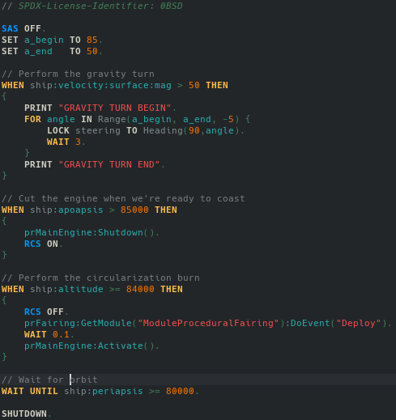
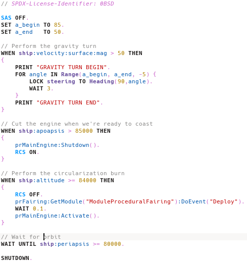
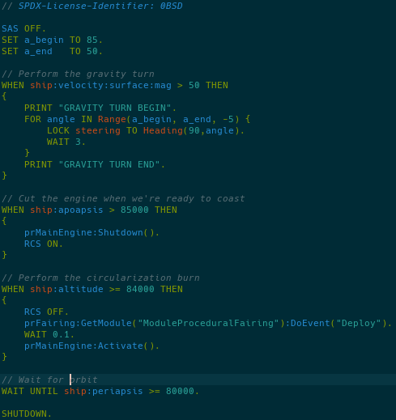
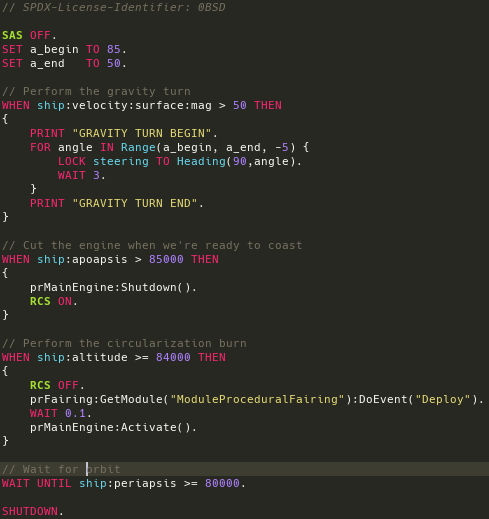

# Kerboscript Syntax Highlighting for KDE Editors

This syntax definition is compatible with KSyntaxHighlight based KDE editors like Kate, KWrite and KDevelop.

## Installation

Download the `kerboscript.xml` file and place it in the `$HOME/.local/share/org.kde.syntax-highlighting/syntax` directory, or equivalent.
The item `Kerboscript` should then become available in language select drop-down menu, in the Scripts section.

## Supported Features

The KSyntaxHighlight framework does static analysis only, with some basic state machine and regex functions, thus this syntax definition relegates itself to valid syntax highlight only, that is, it won't tell you if you committed a mistake. Some limited version of syntax error highlighting is planned, though.

  - Keywords, builtin function/bound variable, toggleables and control flow all have their own highlighting.

  - Comment toggling.

  - Keywords/builtins after colon operator `:` treated as identifier.

  - Your usual batch of literal value highlighting (strings, numbers, etc.).

## Gallery

> Breeze Dark

> Breeze Light

> "Solar Dark" (Solarized lookalike)

> Monokai

## Maintainer

Please tag @vsczpv for any issues.
